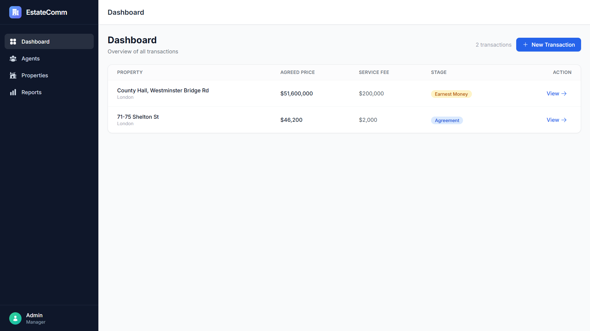
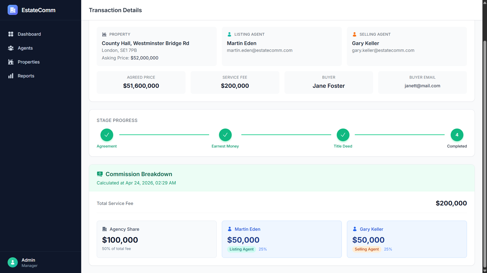
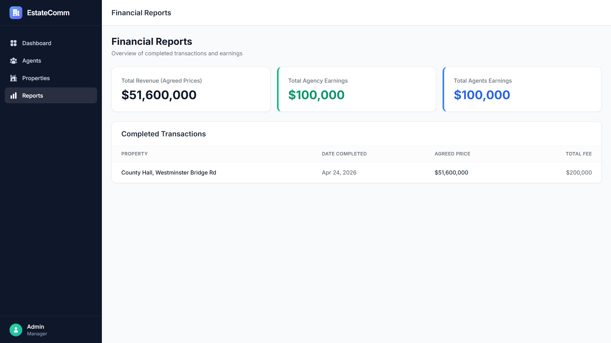
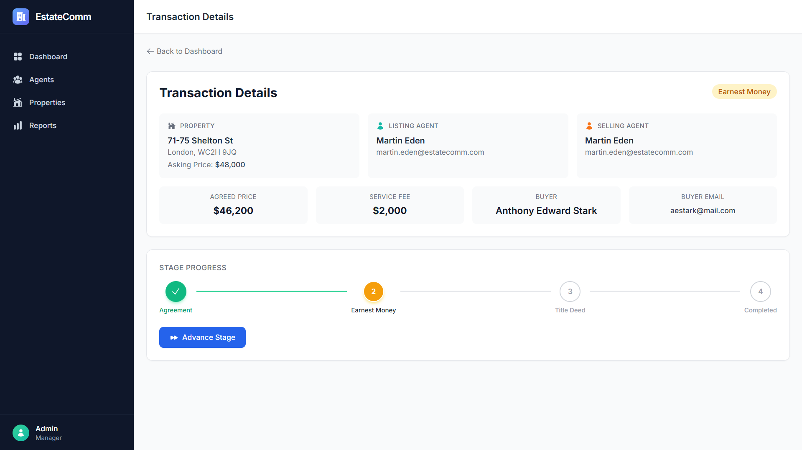
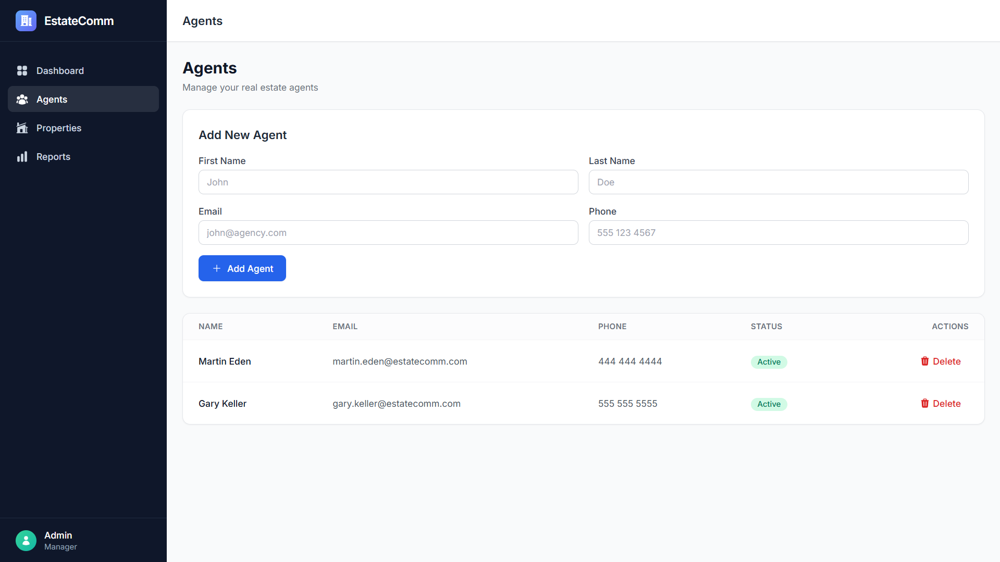
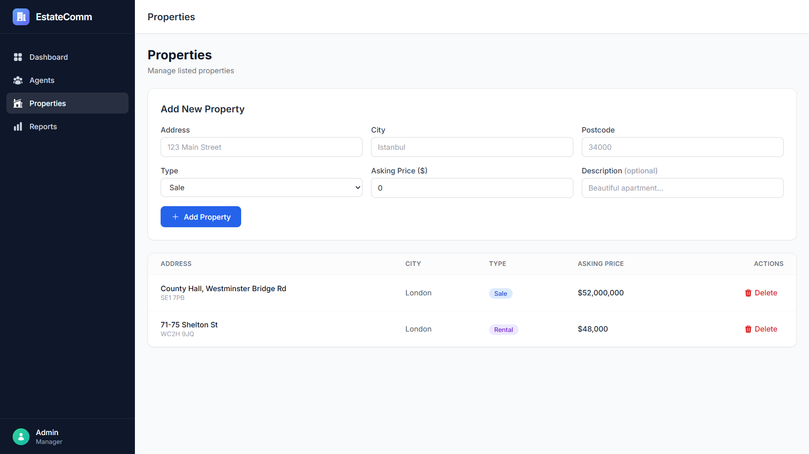
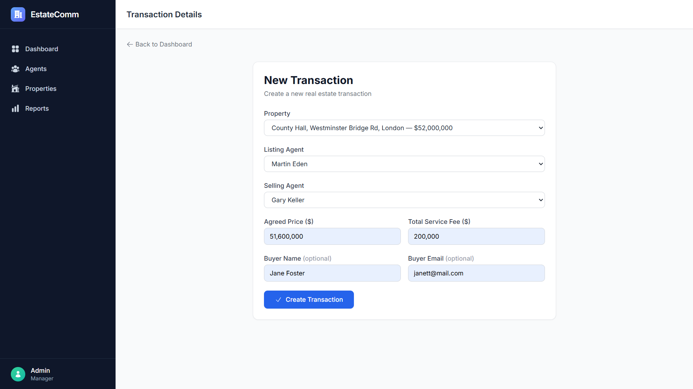
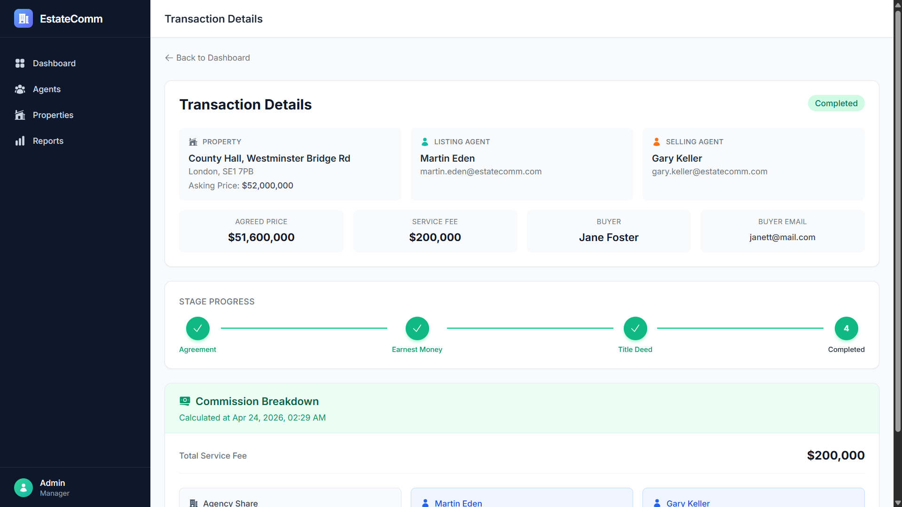

# Estate Commission Manager

A full-stack application for managing real estate transaction lifecycles and automating commission distribution between the agency and its agents.

Built with **NestJS** (backend), **Nuxt 3** (frontend), **MongoDB Atlas** (database), **Pinia** (state management), and **Tailwind CSS** (styling).

---

## Features

- **Transaction Lifecycle** — Track transactions through 4 stages: Agreement → Earnest Money → Title Deed → Completed
- **Automatic Commission Distribution** — 50/50 split between agency and agents, with dual-agent and split-agent scenarios
- **Financial Reports** — Dashboard with summary cards and completed transaction earnings
- **Agent & Property Management** — Full CRUD for agents and properties
- **Stage History** — Audit trail with timestamps and notes for every stage transition
- **Input Validation** — Real-time currency formatting, phone masking, and inline email validation

---

## Tech Stack

| Layer | Technology |
|---|---|
| Backend | NestJS, TypeScript, Mongoose |
| Frontend | Nuxt 3, Pinia, Tailwind CSS |
| Database | MongoDB Atlas |
| Testing | Jest (55 unit tests) |
| Deployment | Vercel (Frontend), Render (Backend) |

---

## Screenshots

### Dashboard Overview

*Main dashboard showing all transactions with stage badges and quick navigation.*

### Commission Breakdown

*Automated financial distribution between agency and agents based on roles (Listing/Selling).*

### Financial Reports

*Summary of total revenue, agency earnings, and agent earnings from completed transactions.*

### Stage Progress

*Visual tracking of the transaction lifecycle and stage history audit trail.*

### Agent Management

*CRUD interface for managing real estate agents and their contact details.*

### Property Portfolio

*Management panel for property listings, types, and pricing.*

### New Transaction Form

*Modern form layout featuring real-time currency formatting, phone masking, and inline email validation.*

### Completed Transaction

*Final view of a successfully closed real estate transaction.*

---

## Getting Started

### Prerequisites

- **Node.js** v18+ (LTS)
- **npm** v9+
- A **MongoDB Atlas** cluster (free tier works)

### 1. Clone the repository

```bash
git clone <repository-url>
cd estate-commission-manager
```

### 2. Backend Setup

```bash
cd backend
npm install
```

Create a `.env` file in the `backend/` directory:

```env
PORT=3001
MONGO_URI=mongodb+srv://<username>:<password>@<cluster>.mongodb.net/<dbname>?retryWrites=true&w=majority
```

Start the development server:

```bash
npm run start:dev
```

The API will be available at `http://localhost:3001`.

### 3. Frontend Setup

```bash
cd frontend
npm install
```

Create a `.env` file in the `frontend/` directory:

```env
NUXT_PUBLIC_API_BASE=http://localhost:3001
```

Start the development server:

```bash
npm run dev
```

The application will be available at `http://localhost:3000`.

---

## Running Tests

```bash
cd backend
npm run test
```

This runs all 55 unit tests across 6 suites covering:
- Commission calculation rules (dual agent & split agent scenarios)
- Stage transition validation (forward-only, no skipping)
- Transaction service operations (CRUD, stage advancement, commission trigger)
- Agent and Property service operations

---

## Deployment

### Frontend (Nuxt 3) — Vercel

1. Push the repository to **GitHub**.
2. Go to [vercel.com](https://vercel.com) and click **"Add New Project"**.
3. Import your GitHub repository.
4. Vercel will auto-detect the `vercel.json` configuration. Set the **Root Directory** to `frontend`.
5. Add the following **Environment Variable** in the Vercel dashboard:
   - `NUXT_PUBLIC_API_BASE` = `https://your-backend-url.com`
6. Click **Deploy**.

### Backend (NestJS) — Vercel / Render / Railway

1. Create a new project on your preferred hosting platform.
2. Set the **Root Directory** to `backend`.
3. Set the **Build Command** to `npm run build` and the **Start Command** to `npm run start:prod`.
4. Add the following **Environment Variables**:
   - `MONGO_URI` = your MongoDB Atlas connection string
   - `PORT` = `3001` (or as required by the platform)
5. Deploy.

> **Important:** Ensure CORS is configured in the backend `main.ts` to allow requests from your deployed frontend URL.

---

## API Endpoints

### Transactions
| Method | Endpoint | Description |
|---|---|---|
| `GET` | `/transactions` | List all transactions (populated) |
| `GET` | `/transactions/:id` | Get transaction by ID (populated) |
| `POST` | `/transactions` | Create a new transaction |
| `PATCH` | `/transactions/:id/advance` | Advance transaction to next stage |

### Agents
| Method | Endpoint | Description |
|---|---|---|
| `GET` | `/agents` | List all agents |
| `GET` | `/agents/:id` | Get agent by ID |
| `POST` | `/agents` | Create a new agent |
| `PATCH` | `/agents/:id` | Update an agent |
| `DELETE` | `/agents/:id` | Delete an agent |

### Properties
| Method | Endpoint | Description |
|---|---|---|
| `GET` | `/properties` | List all properties |
| `GET` | `/properties/:id` | Get property by ID |
| `POST` | `/properties` | Create a new property |
| `PATCH` | `/properties/:id` | Update a property |
| `DELETE` | `/properties/:id` | Delete a property |

---

## Database Reset

To clear all data for a clean demo:

```bash
cd backend
node reset-db.js
```

---

## Project Structure

```
estate-commission-manager/
├── backend/
│   └── src/
│       ├── agents/          # Agent module (CRUD)
│       ├── properties/      # Property module (CRUD)
│       ├── transactions/    # Transaction module (lifecycle + commission)
│       ├── commission/      # Commission calculation (pure logic)
│       ├── stage-machine/   # Stage transition rules (pure logic)
│       └── common/          # Shared utilities
├── frontend/
│   ├── pages/               # Nuxt pages (dashboard, agents, properties, reports)
│   ├── components/          # Reusable Vue components
│   ├── stores/              # Pinia stores
│   ├── layouts/             # App layout with sidebar
│   └── types/               # TypeScript type definitions
├── vercel.json              # Vercel deployment configuration
├── DESIGN.md                # Architecture & design decisions
└── README.md                # This file
```

---

## Design Decisions

See [DESIGN.md](./DESIGN.md) for detailed architectural explanations, including:
- Why commission breakdowns are embedded in the transaction document
- How the stage machine prevents invalid transitions
- Frontend state management patterns
- Deployment strategy

---
# 🇹🇷 Türkçe Özet ve Kurulum

Bu proje, gayrimenkul işlemlerinin anlaşma aşamasından tapu sürecine kadar olan yaşam döngüsünü dijitalleştirmek ve karmaşık komisyon dağıtım kurallarını (acente ve danışman payları) otomatize etmek için geliştirildi. 

Projenin geliştirme sürecinde odak noktası tamamen sistemin asıl amacı olan 'Çekirdek İş Mantığı' (Business Logic) ve temiz bir kullanıcı deneyimi (UX) üzerine kuruldu. Bu doğrultuda, Auth gibi destekleyici modüller yerine eforun büyük kısmını komisyon dağıtım senaryolarının eksiksiz çalışmasına ve bu kritik kuralların birim testleriyle doğrulanmasına ayrıldı.

### Hızlı Kurulum

1. **Backend:** `backend` klasörüne girip `npm install` çalıştırın. Kök dizine bir `.env` dosyası açıp `MONGO_URI` (MongoDB Atlas linkiniz) ve `PORT=3001` değişkenlerini ekleyin. `npm run start:dev` ile ayağa kaldırabilirsiniz.

2. **Frontend:** `frontend` klasörüne girip `npm install` çalıştırın. Kök dizine bir `.env` dosyası açıp `NUXT_PUBLIC_API_BASE=http://localhost:3001` ekleyin. `npm run dev` ile arayüze ulaşabilirsiniz.

3. **Testler:** Backend klasöründeyken `npm run test` komutuyla tüm testlerin başarıyla geçtiğini (PASS) görebilirsiniz. Demo öncesi veritabanını temizlemek isterseniz `node reset-db.js` komutunu kullanabilirsiniz.
